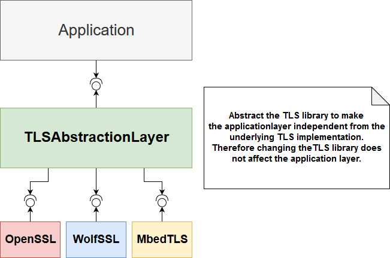
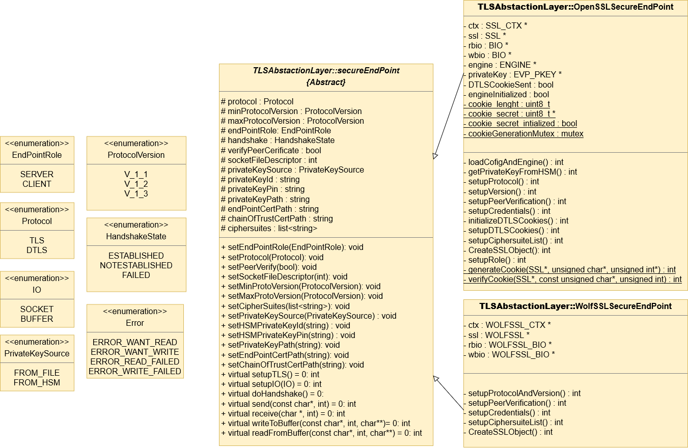

# Table of content

[1. Introduction](#1-introduction)

[2. Architecture](#2-architecture)

[3. Functionalities](#3-functionalities)

[4. Methods Documentation](#4-methods-documentation)

[5. Demo](#5-demo)

[6. Compile](#6-compile)

## 1. Introduction

The TLSAbstractionLayer provides an API to the application layer allowing to use TLS independently from the underlying TLS library (e.g. openSSL, wolfSSL, etc…)



## 2. Architecture

The abstraction layer consists of the abstract class 
**SecureEndPoint** and several other classes, each implements TLS for a certain library. As illustrated in the class diagram, the class **SecureEndPoint** specifies the interface provided to the application layer and as an example the class **OpenSSLSecureEndPoint** implements the interface based on **OpenSSL**. In order to support another library, for instance, wolfSSL, a new class should be created which shall inherit from the class **SecureEndPoint** and implement the interface based on wolfSSL. The application using the abstraction layer is therefore independent from the underlying TLS library.




## 3. Functionalities

The TLSAbstractionLayer allows the application layer to:
*  Set the protocol, which could be whether TLS or DTLS.
*  Set the endpoint's role, which could be whether client or server.
*  Set the endpoint's certificate.
*  Set the chain of trust certificate.
*  Configure the server to request a certificate from the client (mutual authentication optional).
*  Set the list of the cipher suites and their priorities.
*  Set the minimum and the maximum TLS versions to use (e.g. min version TLSv1.1 and max version TLSv1.2).
*  Choose whether to use the private key from a file or from a HSM.
*  Bind an existing TCP socket to a SecureEndpoint object.
*  Write encrypted data to a socket.
*  Decrypt data from a socket.
*  Write encrypted data to a memory buffer.
*  Decrypt data from a memory buffer.


## 4. Methods Documentation

```c++
   /**
     * \brief Set the protocol
     *
     * \warning The changes will not take place until calling setupTLS method
     */
    void setProtocol(Protocol);

    /**
     * \brief Set the endpoint role
     *
     * \warning The changes will not take place until calling setupTLS method
     */
    void setEndPointRole(EndPointRole);

    /**
     * \brief Set the minimum protocol version
     *
     * \warning The changes will not take place until calling setupTLS method
     */
    void setMinProtocolVersion(ProtocolVersion);

    /**
     * \brief Set the maximum protocol version
     *
     * \warning The changes will not take place until calling setupTLS method
     */
    void setMaxProtocolVersion(ProtocolVersion);

    /**
     * \brief Configures the authentication, if true is passed the handshake
     *  will fail if no certificate is received or if the certificate is not
     *  verified
     *
     * \warning The changes will not take place until calling setupTLS method
     */
    void setPeerVerify(bool);

    /**
     * \brief Set the socket file descriptor of an existing socket
     *
     * \warning If the transport protocol is TCP, the socket shall be connected
     * \warning The changes will not take place until calling setupIO method
     */
    void setSocketFileDescriptor(int);

    /**
     * \brief Set the private source
     *
     * \warning if the private key source is set to the value FROM_FILE, The TLS library
     *  loads the private key from a file. In this case the RSA operations are done by the TLS
     *  library and the private key is stored in RAM. However, if the private key source is set
     *  to the value FROM_HSM, the TLS library delegates the RSA operations to a HSM.
     *  In this case the private key is not retrieved and exists only inside the HSM.
     */
    void setPrivateKeySource(PrivateKeySource pkSource);

    /**
     * \brief Set the private key ID to be used from the HSM
     * \warning This function should be used only if the private key source is set
     *  to the value FROM_HSM
     */
    void setHSMPrivateKeyId(const std::string& pkId);

    /**
     * \brief Set the private key PIN
     * \warning This function should be used only if the private key source is set
     *  to the value FROM_HSM
     */
    void setHSMPrivateKeyPin(const std::string& pkPin);

    /**
     * \brief Set the private key path
     *
     * \warning The changes will not take place until calling setupTLS method
     */
    void setPrivateKeyPath(const std::string&);

    /**
     * \brief Set the endpoint certificate path
     *
     * \warning The changes will not take place until calling setupTLS method
     */
    void setEndPointCertPath(const std::string&);

    /**
     * \brief Set the chain of trust certificate path, while establishing the
     *  handshake, the certificate of the second endpoint will be verified
     *  using against this certificate
     *
     * \warning The changes will not take place until calling setupTLS method
     */
    void setChainOfTrustCertPath(const std::string&);

    /**
     * \brief Configure the cipher suite list, the priority of the cipher suites
     *  is determined based on the order in the given list.
     *  the first cipher suite in the list will have the highest priority.
     *  If multiple TLS (or DTLS) versions may be used for the handshake.
     *  the list shall start by the cipher suites of the min version going up to
     *  to the max version. If the cipher suite list is not configured explicitly using
     *  this method, a default list is set.
     */
    void setCipherSuiteList(const std::list<std::string>&);

    /**
     * \brief apply the configurations with regards to TLS (or DTLS)
     *
     * \warning should be called after configuring all the attributes.
     *  if a parameter is not configured, the setup fails
     */
    virtual int setupTLS() = 0;

    /**
     * \brief apply the IO configuration
     *  this method allows to choose the IO, the IO could be a socket
     *  or a memory (buffer)
     *
     * \warning shall be called after configuring all the attributes.
     *  if a parameter is not configured, the setup fails
     */
    virtual int setupIO(IO) = 0;

    /**
     * \brief Establish TLS (or DTLS) handshake
     *
     */
    virtual int doHandshake() = 0;

    /**
     * \brief Send data securely
     *
     * \warning This method shall not be called if the handshake is not established
     *  or failed
     * \warning This method shall not be used if the IO is configured to memory.
     *  this method is only used to send data over a socket
     */
    virtual int send(const char *, int) = 0;

    /**
     * \brief Receive data securely
     *
     * \warning This method shall not be called if the handshake is not established
     *  or failed
     * \warning This method shall not be used if the IO is configured to memory.
     *  this method is only used to receive data over a socket
     */
    virtual int receive(char *, int) = 0;

    /**
     * \brief Write the protected data to a buffer instead of writing directly to
     * a socket.
     *
     * \warning This method shall not be called if the handshake is not established
     *  or failed
     * \warning This method shall not be used if the IO is configured to socket.
     * \warning This method allocates memory to write the encrypted message,
     *  freeing encMsg should be handled manually
     *
     * \param clearMsg buffer containing the plain text message to be encrypted.
     * \param clearMsgsize size of the plain text message
     * \param encMsg char pointer in which the encrypted message will be written
     *
     * \return size of the encrypted message
     */
    virtual int writeToBuffer(const char *clearMsg, int clearMsgsize, char ** encMsg) = 0;

    /**
     * \brief Read the protected data from a buffer instead of reading directly from
     * a socket.
     *
     * \warning This method shall not be called if the handshake is not established
     *  or failed
     * \warning This method shall not be used if the IO is configured to socket.
     * \warning This method allocates memory to write the decrypted message,
     *  freeing plainTextMsg should be handled manually
     *
     * \param encMsg buffer containing the encrypted message
     * \param encMsgSize size of the encrypted message
     * \param clearMsg buffer in which the decrypted message will be written
     *
     * \return size of the plain text message
     */
    virtual int readFromBuffer(const char * encMsg, int encMsgsize, char **clearMsg) = 0;
```
## 5. Demo


To use the library, the application shall include the TLSAbstractionLayer header file which corresponds to one of the supported TLS libraries. Currently, the supported TLS libraries are OpenSSL and WolfSSL. 

To use the OpenSSL based implementation, the following header file shall be included.

```c++
#include <TLSAbstractionLayer/OpenSSLSecureEndPoint.hpp>
```

To use the WolfSSL based implementation, the following header file shall be included.

```c++
#include <TLSAbstractionLayer/WolfSSLSecureEndPoint.hpp>
```

The application could use both of the libraries by including both of the header files.

```c++
#include <TLSAbstractionLayer/WolfSSLSecureEndPoint.hpp>
#include <TLSAbstractionLayer/OpenSSLSecureEndPoint.hpp>
```

The application shall create a *SecureEndPoint* instance based on the preferred implementation (WolfSSL or OpenSSL).

To use OpenSSL, the application shall instantiate an object form the class *OpenSSLSecureEndPoint*.
```c++
TLSAbstractionLayer::OpenSSLSecureEndPoint tlsServer;
```

To use WolfSSL, the application shall instantiate an object from the class *WolfSSLSecureEndPoint*.

```c++
TLSAbstractionLayer::WolfSSLSecureEndPoint tlsServer;
```

The next steps are the same for both of the libraries.

The application shall set the protocol and the endpoint role. In this example we set the protocol to TLS and the endpoint role to server.

```c++
tlsServer.setProtocol(TLSAbstractionLayer::Protocol::TLS);
tlsServer.setEndPointRole(TLSAbstractionLayer::EndPointRole::SERVER);
```

The application shall set the endpoint's certificate and the chain of trust certificate.
The variable *cert* is a string which contains the endpoint's certificate path. The variable *cacert* is a string which contains the chain of trust certificate path.

```c++
tlsServer.setEndPointCertPath(cert);
tlsServer.setChainOfTrustCertPath(cacert);
```

The application shall configure the client authentication. the variable *verifyPeerCerificate* is of type boolean. If *verifyPeerCerificate* is set to *true*, the server requests a client certificate during the handshake. If *verifyPeerCerificate* is set to *false*, the server doesn't send a certificate request to the client during the handshake.

```c++
tlsServer.setPeerVerify(verifyPeerCerificate);
```

The application should set cipher suite list. If the cipher suite list is not set explicitly, a default cipher suite list will be used. *l* is a list of strings. The priority of the cipher suites is determined from the order in the list. In this example, the cipher suite *TLS_ECDHE_RSA_WITH_AES_128_CBC_SHA256* has the highest priority and the cipher suite *TLS_ECDHE_RSA_WITH_AES_256_GCM_SHA384* has the lowest priority.

```
l.push_back(TLSAbstractionLayer::TLS_ECDHE_RSA_WITH_AES_128_CBC_SHA256);
l.push_back(TLSAbstractionLayer::TLS_ECDHE_RSA_WITH_AES_128_GCM_SHA256);
l.push_back(TLSAbstractionLayer::TLS_ECDHE_RSA_WITH_AES_128_GCM_SHA256);
l.push_back(TLSAbstractionLayer::TLS_ECDHE_RSA_WITH_AES_256_GCM_SHA384);
tlsServer.setCipherSuiteList(l);
```

The application shall set the minimum and the maximum TLS versions. In the following example we configured the tlsServer object to use only TLS version 1.2.

```
tlsServer.setMinProtocolVersion(TLSAbstractionLayer::ProtocolVersion::V_1_2);
tlsServer.setMaxProtocolVersion(TLSAbstractionLayer::ProtocolVersion::V_1_2);
```


The application shall set the source of the private key. Specify whether to use the private from a file or from a HSM. If the application prefers to use the private from a file, the application shall do as the following:

```c++
tlsServer.setPrivateKeySource(TLSAbstractionLayer::PrivateKeySource::FROM_FILE);
tlsServer.setPrivateKeyPath(pk);
```

In the previous example the application sets first the private key source, which is in this case specified to be from a file, then, sets the private key file path. *pk* is a string which contains the private key file path.

If the application prefers to use the private key from a HSM, the application shall do as the following:

```c++
tlsServer.setPrivateKeySource(TLSAbstractionLayer::PrivateKeySource::FROM_HSM);
tlsServer.setHSMPrivateKeyId(privateKeyId);
tlsServer.setHSMPrivateKeyPin(privateKeyPin);
```

The application sets first the private key source to be used from a HSM. Please note that this doesn't mean that the private key will be retrieved from the HSM, instead, this means that the RSA signature (for DH parameters) will be performed by the HSM and not by OpenSSL. The application then sets the private key ID and the private key PIN. The private key ID shall be a string in the format "slot:id". This string indicates to the HSM which key to be used for the RSA signature. the variable *privateKeyPin* is a string which shall contain the private key PIN.

After configuring the *tlsServer* object, the application shall call the method setupTLS() to apply the changes.


```c++
tlsServer.setupTLS();
```

One last step before establishing the handshake is to configure the IO operations. The application can choose among two options, whether to use a socket or a read and a write buffers. In this example we use a socket as IO for establishing the handshake and then we use a read and a write buffers (memory IO) for the application data. To use a socket for the IO operations, the application shall first set a socket file descriptor and call the setupIO() method to apply the changes. Please note that the socket shall be already connected to a client (The TCP 3-way handshake shall be already established).

```c++
tlsServer.setSocketFileDescriptor(client_sock);
tlsServer.setupIO(TLSAbstractionLayer::IO:SOCKET);
```

As the *tlsServer* object if fully configured (TLS configuration and IO configuration) and the TCP 3-way handshake is established, the application can call the doHandshake() method to start the handshake (In this case the endpoint's role is server, therefore the *tlsServer* object will wait for the client to initiate the handshake with a client hello message).

```c++
tlsServer.doHandshake();
```

After that the handshake is established, the server can start sending secure data to the client.
As we mentioned previously, for the application data we will use a memory IO. The application shall call the method setupIO() to set the IO configuration to memory IO.

```c++
tlsServer.setupIO(TLSAbstractionLayer::IO::BUFFER);
```

Before sending the application data to the client, the data shall be secured first (encryption and MAC). In the following example, *MSG* is the plain text message to be sent to the client and *encMsg* is the string which will contain the secured data. The method writeToBuffer() takes three arguments, the plain text message, the size of the plain text message and a buffer in which it writes the secured data. writeToBuffer() allocates the necessary memory to write the secured data into the given buffer and returns the size of the secured message. For more details please refer to the methods documentation in the Home page.


```c++
char * encMsg;
printf("Plain text message  --> clearMsg : %s, clearMsgsize: %d\n",MSG,sizeof(MSG));
int ret = tlsServer.writeToBuffer(MSG,sizeof(MSG),&encMsg);
printf("Encrypted message --> encMsg :%s, size: %d\n",encMsg,ret);
```

Now the data could be sent through the network using the socket API. *client_sock* is the socket connected to the client, *encMsg* is the secured message and *ret* is the size of the secured message.


```c++
send(client_sock,encMsg,ret,0);
```

Below is a full example of a TCP server using the class *OpenSSLSecureEndpoint*.
For more details please refer to the folder examples.


```c++
#include <stdio.h>
#include <unistd.h>
#include <sys/socket.h>
#include <arpa/inet.h>
#include <TLSAbstractionLayer/OpenSSLSecureEndPoint.hpp>


#define PORT 			    4433
#define CERTIFICATE_PATH            "./ca/intermediate/certs/server.cert.pem"
#define CHAIN_OF_TRUST_CERT_PATH    "./ca/intermediate/certs/ca-chain.cert.pem"
#define MSG 		            "Hello world"

using namespace TLSAbstractionLayer;


int main(int argc, char **argv)
{

  int listen_sock = 0;
  int handshake = 0;
  struct sockaddr_in addr;

  //Create socket, bind and listen for connections
  addr.sin_family = AF_INET;
  addr.sin_port = htons(PORT);
  addr.sin_addr.s_addr = htonl(INADDR_ANY);

  listen_sock = socket(AF_INET, SOCK_STREAM, 0);
  if (listen_sock < 0)
  {
    perror("Unable to create socket");
    exit(EXIT_FAILURE);
  }
  else
  {
    printf("Socket created, sock fd: %d\n",listen_sock);
  }

  if (bind(listen_sock, (struct sockaddr*)&addr, sizeof(addr)) < 0)
  {
    perror("Unable to bind");
    exit(EXIT_FAILURE);
  }

  if (listen(listen_sock, 1) < 0)
  {
    perror("Unable to listen");
    exit(EXIT_FAILURE);
  }


    /* Handle connections */
    while(1)
    {
      struct sockaddr_in addr;
      uint len = sizeof(addr);
	    printf("Listening for connections ...\n");
      int client_sock = accept(listen_sock, (struct sockaddr*)&addr, &len);
      if (client_sock < 0)
      {
        perror("Unable to accept");
        exit(EXIT_FAILURE);
      }
      else
      {
  	printf("Accepted connection, TCP handshake established\n");
      }


      std::string cert = CERTIFICATE_PATH;
      std::string cacert = CHAIN_OF_TRUST_CERT_PATH;
      bool verifyPeerCerificate = true;
      std::list<std::string> l;
      std::string privateKeyId = "0:01";
      std::string privateKeyPin = "0000";

      TLSAbstractionLayer::OpenSSLSecureEndPoint tlsServer;

      /* Set protocol and role */
      tlsServer.setProtocol(TLSAbstractionLayer::Protocol::TLS);
      tlsServer.setEndPointRole(TLSAbstractionLayer::EndPointRole::SERVER);
      /* Set protocol and role */

      /* Configure certificates */
      tlsServer.setEndPointCertPath(cert);
      tlsServer.setChainOfTrustCertPath(cacert);
      tlsServer.setPeerVerify(verifyPeerCerificate);
      /* Configure certificates */

      /* Configure ciher suites */
      l.push_back(TLSAbstractionLayer::TLS_ECDHE_RSA_WITH_AES_128_CBC_SHA256);
      tlsServer.setCipherSuiteList(l);
      /* Configure ciher suites */

      /* Configure TLS version */
      tlsServer.setMinProtocolVersion(TLSAbstractionLayer::ProtocolVersion::V_1_2);
      tlsServer.setMaxProtocolVersion(TLSAbstractionLayer::ProtocolVersion::V_1_2);
      /* Configure TLS version */

      /* Configure HSM attributes */
      tlsServer.setPrivateKeySource(TLSAbstractionLayer::PrivateKeySource::FROM_HSM);
      tlsServer.setHSMPrivateKeyId(privateKeyId);
      tlsServer.setHSMPrivateKeyPin(privateKeyPin);
      /* Configure HSM attributes */

      /* Set socket fd */
      tlsServer.setSocketFileDescriptor(client_sock);
      /* Set socket fd */

      int s = tlsServer.setupTLS();
      if (s == -1) {
        printf("TLS setup failed\n");
        return -1;
      }

      s = tlsServer.setupIO(TLSAbstractionLayer::IO::SOCKET);
      if (s == -1) {
        printf("IO setup failed\n");
        return -1;
      }

      int res = tlsServer.doHandshake();

      s = tlsServer.setupIO(TLSAbstractionLayer::IO::BUFFER);
      if (s == -1) {
        printf("IO setup failed\n");
        return -1;
      }

      if (res == TLSAbstractionLayer::HandshakeState::ESTABLISHED) {
        printf("Plain text message  --> clearMsg : %s, clearMsgsize: %d\n",MSG,sizeof(MSG));

        char * encMsg;
        int ret = tlsServer.writeToBuffer(MSG,sizeof(MSG),&encMsg);
        printf("Encrypted message --> encMsg :%s, size: %d\n",encMsg,ret);
        send(client_sock,encMsg,ret,0);
      }
      else if(res == TLSAbstractionLayer::HandshakeState::FAILED)
      {
        printf("Handshake failed\n");
      }
      close(client_sock);
		  printf("Connection closed\n");
    }

    close(listen_sock);
}
```
## 6. Compile

First we have to create a folder with the name **build** in the project root directory.

```bash
mkdir build
```

As the library depends on OpenSSL, we have to specify the folder containing OpenSSL libraries (libcrypto and libssl). The environment variable OPENSSL_LIB_DIR shall be set to the folder containing OpenSSL's libraries.

```bash
export OPENSSL_LIB_DIR=/absolute/path/to/openssl/lib/dir
```

The library depends also on WolfSSL, therefore, we have to specify the folder containing WolfSSL library (libwolfssl). The environment variable WOLFSSL_LIB_DIR shall be set to the folder containing WolfSSL's library.

```bash
export WOLFSSL_LIB_DIR=/absolute/path/to/wolfssl/lib/dir
```

Another alternative is to use the libraries provided with the TLSAbstractionLayer. You could find OpenSSL's and WolfSSL's libraries under the folder libs.

To build only the shared library, execute the following command:

```bash
make sharedlib
```

To build the shared library as well as the examples, execute the following command:

```bash
make
```

To execute one of the examples for instance, server.exe, execute the following commands:

```bash
cd examples
export LD_LIBRARY_PATH=../build:$OPENSSL_LIB_DIR:$WOLFSSL_LIB_DIR:$LD_LIBRARY_PATH
./server.exe
```

The previous steps allow only to use the library without a HSM. If we try to execute for example the executable server_hsm.exe an error will occur. We use in the following a software HSM implementation to make the HSM examples work.

First we have to install the HSM library.

```bash
cd libs/softwareHSM
./install.sh
```

After installing the HSM library, we can use its command line to import some keys.
Please note that keys shall be in the PKCS#8 format. To convert a key from the pem format to the PKCS#8 format the following openssl command line can be used.

```bash
openssl pkcs8 -topk8 -inform PEM -outform DER -in key.pem -out key.pkcs8 -nocrypt
```

In the folder libs/softwareHSM/keys_example we have a client private key and a server server private key in both formats PEM and PKCS8.

We use now the HSM command line to import the keys into the HSM.

```bash
./softhsm --init-token --slot 0 --label "server-key"
./softhsm --import ./keys_example/server_pkcs8.key --slot 0 --label "server-private-key" --id 01 --pin 0000
./softhsm --init-token --slot 1 --label "client-key"
./softhsm --import ./keys_example/client_pkcs8.key --slot 1 --label "client-private-key" --id 02 --pin 0000
```
now the HSM examples can be executed successfully.

